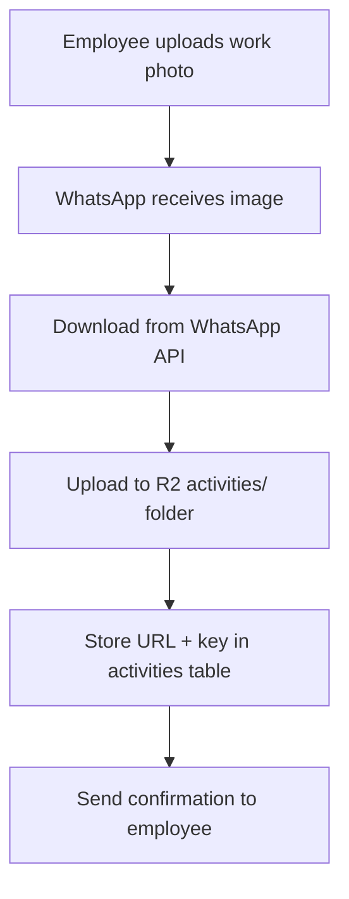
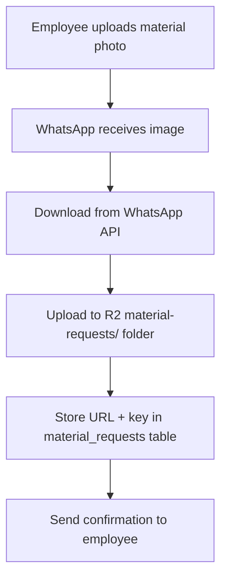

# Cloudflare R2 Image Upload Integration

## Overview

The WhatsApp bot now includes comprehensive image upload functionality using Cloudflare R2 for storage. Images can be uploaded during activity logging, material requests, and potentially other flows, with all images securely stored in the cloud.

## Features Implemented

### 🔧 **Cloudflare R2 Service** (`src/services/cloudflareR2.ts`)

A comprehensive service that handles:
- ✅ Direct file uploads to Cloudflare R2
- ✅ WhatsApp media download and upload to R2
- ✅ Signed URL generation for secure access
- ✅ File deletion capabilities
- ✅ Organized folder structure (`activities/`, `material-requests/`, etc.)

### 📋 **Updated Employee Flow** (`src/services/flows/employeeFlow.ts`)

#### Activity Logging with Images:
1. **Site Selection** → **Activity Type** → **Hours** → **Description** → **📸 Image Upload** → **Completion**
2. Images stored in `activities/` folder
3. Supports skipping image upload
4. Stores both public URL and management key in database

#### Material Requests with Images:
1. **Site Selection** → **Material** → **Quantity** → **Urgency** → **📸 Image Upload** → **Completion**
2. Images stored in `material-requests/` folder
3. Supports skipping image upload
4. Helps procurement team visualize requirements

### 🗄️ **Updated Database Schema**

Added image storage fields to relevant tables:

```sql
-- Activities table
ALTER TABLE activities ADD COLUMN image_url TEXT;
ALTER TABLE activities ADD COLUMN image_key TEXT;

-- Material requests table  
ALTER TABLE material_requests ADD COLUMN image_url TEXT;
ALTER TABLE material_requests ADD COLUMN image_key TEXT;

-- Sites table
ALTER TABLE sites ADD COLUMN image_url TEXT;
ALTER TABLE sites ADD COLUMN image_key TEXT;
```

## Environment Configuration

Required environment variables in `.env`:

```bash
# Cloudflare R2 Configuration
CLOUDFLARE_R2_ACCESS_KEY="37d92a0cc181b5cada8805126ecf0cc1"
CLOUDFLARE_R2_SECRET_KEY="813cdf431e0a5cbe1b98a103b522ffaae10b82319941518cf0e5d02bf98fff39"
CLOUDFLARE_R2_BUCKET="reeva-erp"
CLOUDFLARE_R2_REGION="auto"
CLOUDFLARE_R2_ENDPOINT="https://c924773969fa9cd80ba2bf5bae7cfb00.r2.cloudflarestorage.com"
```

## Image Upload Flow

### 1. **Activity Logging Image Upload**



**Gujarati Messages:**
- Upload prompt: "📸 કૃપા કરીને કામનો ફોટો અપલોડ કરો"
- Uploading: "📤 રસિદ અપલોડ કરી રહ્યા છીએ..."
- Success: "✅ ફોટો સફળતાપૂર્વક અપલોડ થયો!"

### 2. **Material Request Image Upload**



**Gujarati Messages:**
- Upload prompt: "📸 કૃપા કરીને સામગ્રીનો ફોટો અપલોડ કરો"
- Types: "• જરૂરી સામગ્રીનો ફોટો • હાલની સામગ્રીની સ્થિતિનો ફોટો"

## File Organization

### R2 Bucket Structure:
```
reeva-erp/
├── activities/
│   ├── uuid1.jpg (work photos)
│   ├── uuid2.png
│   └── ...
├── material-requests/
│   ├── uuid3.jpg (material photos)
│   ├── uuid4.png
│   └── ...
├── sites/
│   ├── uuid5.jpg (site photos/logos)
│   └── ...
└── test-uploads/
    └── (test files)
```

## Database Schema Updates

### Activities Table:
```sql
CREATE TABLE activities (
  id UUID PRIMARY KEY,
  user_id UUID REFERENCES users(id),
  site_id UUID REFERENCES sites(id),
  activity_type VARCHAR(100),
  hours INTEGER,
  description TEXT,
  image_url TEXT,           -- Public Cloudflare R2 URL
  image_key TEXT,           -- R2 object key for management
  details JSONB,
  created_at TIMESTAMP DEFAULT NOW()
);
```

### Material Requests Table:
```sql
CREATE TABLE material_requests (
  id UUID PRIMARY KEY,
  user_id UUID REFERENCES users(id),
  material_name VARCHAR(255),
  quantity INTEGER,
  unit VARCHAR(50),
  site_id UUID REFERENCES sites(id),
  urgency TEXT CHECK (urgency IN ('low', 'medium', 'high')),
  status TEXT CHECK (status IN ('pending', 'approved', 'delivered', 'cancelled')),
  image_url TEXT,           -- Public Cloudflare R2 URL
  image_key TEXT,           -- R2 object key for management
  requested_date TIMESTAMP,
  notes TEXT,
  created_at TIMESTAMP DEFAULT NOW()
);
```

## Testing

### Test Scripts Available:

```bash
# Test Cloudflare R2 integration
npm run test-r2

# Test activity logging with database
npm run test-activity

# Test overall system
npm run dev
```

### Test Results:
- ✅ R2 upload/download/delete operations working
- ✅ WhatsApp media processing working
- ✅ Database schema updated successfully
- ✅ Employee flow integration complete

## Security Features

1. **Unique File Names**: Every uploaded file gets a UUID-based name
2. **Organized Folders**: Files organized by purpose (activities, materials, etc.)
3. **Key Management**: Both public URL and management key stored
4. **Access Control**: Uses Cloudflare R2's built-in security
5. **Signed URLs**: Can generate time-limited secure access URLs

## API Integration

### WhatsApp Media Processing:
- Downloads media from WhatsApp API using access token
- Supports multiple image formats (JPEG, PNG, etc.)
- Preserves original captions
- Handles failed uploads gracefully

### Cloudflare R2 Integration:
- S3-compatible API using AWS SDK
- Auto-retry and error handling
- Public URL generation for easy access
- Key-based file management

## Error Handling

### Upload Failures:
- Shows error message in Gujarati
- Allows retry or skip option
- Logs detailed error information
- Graceful fallback to continue flow

### Network Issues:
- Timeout handling
- Automatic retry logic
- User-friendly error messages
- Maintains conversation state

## Future Enhancements

### Potential Additions:
1. **Image Compression** - Optimize images before upload
2. **Multiple Images** - Support multiple photos per activity
3. **Image Thumbnails** - Generate thumbnails for quick preview
4. **Image Metadata** - Store EXIF data, geolocation, etc.
5. **Image Gallery** - View all uploaded images in dashboard
6. **Image Analytics** - Track upload success rates, sizes, etc.

## Monitoring & Analytics

### Metrics to Track:
- Upload success/failure rates
- Average file sizes
- Storage usage by category
- Popular upload times
- Error types and frequencies

### Logs Available:
- Successful uploads with URLs
- Failed upload attempts with errors
- R2 API response times
- File deletion operations

## Cost Optimization

### R2 Cost Factors:
- **Storage**: ~$0.015/GB/month
- **Operations**: Class A (writes) ~$4.50/million, Class B (reads) ~$0.36/million
- **Data Transfer**: Free egress within Cloudflare network

### Optimization Strategies:
- Automatic file compression
- Lifecycle policies for old files
- Regular cleanup of test uploads
- Monitor storage usage trends

## Support & Troubleshooting

### Common Issues:

1. **Upload Timeout**
   - Check network connectivity
   - Verify R2 credentials
   - Check file size limits

2. **Access Denied**
   - Verify R2 access keys
   - Check bucket permissions
   - Validate endpoint URL

3. **WhatsApp Media Download Failed**
   - Check WhatsApp access token
   - Verify media ID validity
   - Check token permissions

### Debug Commands:
```bash
# Test R2 connection
npm run test-r2

# Check environment variables
node -e "console.log(process.env.CLOUDFLARE_R2_BUCKET)"

# View server logs
tail -f server.log | grep -i "r2\|upload\|error"
```

This integration provides a robust, scalable solution for image management in the WhatsApp ERP bot, supporting the workflow needs of construction and project management teams. 